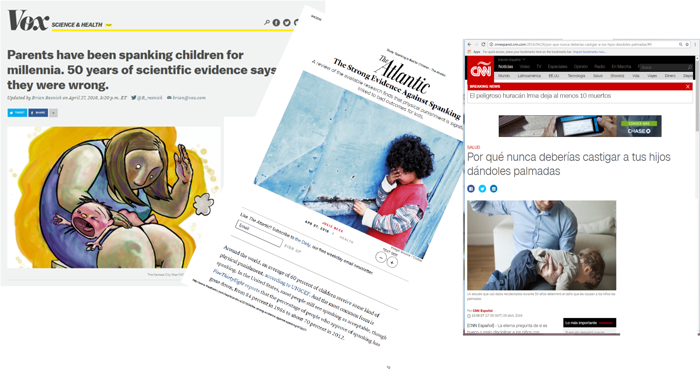

# Rationale {.smaller}

> "Whether spanking is helpful or harmful to children continues to be the source of considerable debate among both researchers and the public. This article addresses 2 persistent issues, namely whether effect sizes for spanking are distinct from those for physical abuse, and whether effect sizes for spanking are robust to study design differences. Meta-analyses focused specifically on spanking were conducted on a total of 111 unique effect sizes representing 160,927 children. Thirteen of 17 mean effect sizes were significantly different from zero and all indicated a link between spanking and increased risk for detrimental child outcomes. Effect sizes did not substantially differ between spanking and physical abuse or by study design characteristics." [@Gershoff2016]

# Results

```{r}
#| echo: false
#| message: false
#| warning: false

library(readr)

CP_Meta_summary_results <- read_csv("CP-Meta-summary-results.csv")

library(ggplot2)

library(plotly)

p1 <- ggplot(CP_Meta_summary_results,
             aes(x = reorder(Outcome, d),
                 y = d,
                 label = Outcome,
                 fill = d)) + 
  geom_bar(stat = "identity") +
  scale_fill_viridis_c() +
  coord_flip() +
  labs(title= "Effect Sizes of Physical Punishment",
       x = "Outcome",
       y = "Cohen's d Effect Size",
       caption = "Gershoff and Grogan-Kaylor, 2016") +
  theme(legend.position = "none",
        title = element_text(size = rel(1.5)),
        axis.text = element_text(size = rel(.75)))

ggplotly(p1, tooltip = c("fill", "label"))

```

# Publicity



# Moving Forward

## Impact

* Policy Statement by *American Academy of Pediatrics*
* Policy Statement by *American Psychological Association*

## Part of the Conversation

* More recent work ➡️ oral testimony by colleague before *First Commission of the Congress of Colombia*.
* Colombia instituted a ban on physical punishment in Summer 2020.
* Cited in *Corporal Punishment Of Children The Public Health Impact* (WHO Report).

# References

