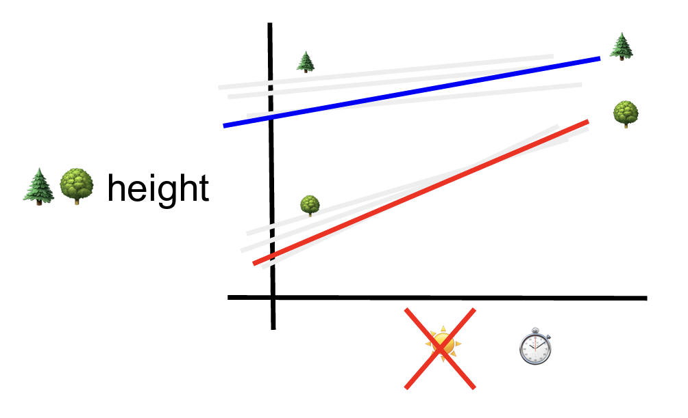

# Cross-Sectional

$height_{ij} = \beta0 + \beta_1 sunshine + \beta_2 type + \beta_3 sunshine * type + u_{0j} + u_{1j} sunshine + e_{ij}$

`mixed height c.sunshine##i.type || forest: sunshine`

# Longitudinal 

$height_{ij} = \beta0 + \beta_1 time + \beta_2 type + \beta_3 time * type + u_{0j} + u_{1j} sunshine + e_{ij}$

`mixed height c.time##i.type || forest: time`

