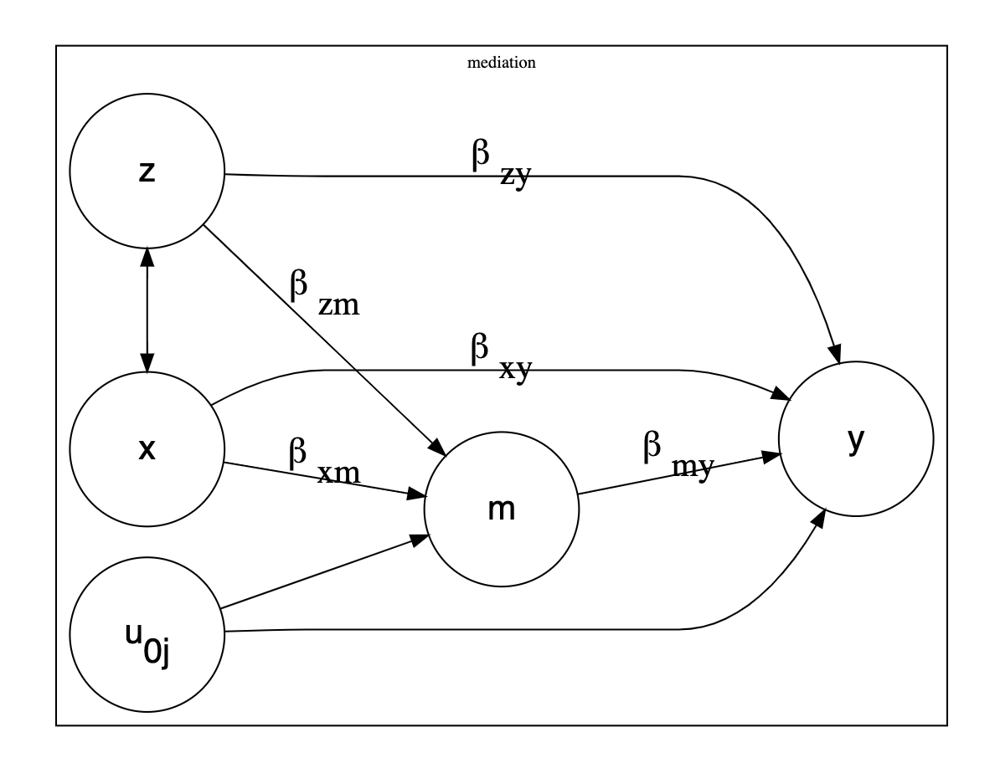

# Multilevel Mediation

## Introduction

A folder with an example of multilevel mediation.

Under development. Comments, questions, and corrections are most welcome.

[Here](https://github.com/agrogan1/multilevel/blob/master/multilevel-mediation/multilevel-mediation.do) is a direct link to the `do` file above.

Perhaps helpfully, perhaps confusingly, I have included syntax for mediation with clustered standard errors.

The graphs (`.png` files) help to understand why the *multilevel* and *clustered standard error* analyses give different results.

## Diagram

## Equations

$y = \beta_0 + \beta_{my} m + \beta_{xy} x + \beta_{zy} z + u_{0j}$

$m = \beta_0 + \beta_{xm} x + \beta_{zm} z + u_{0j}$

