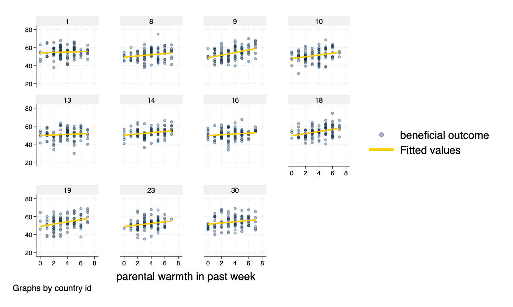
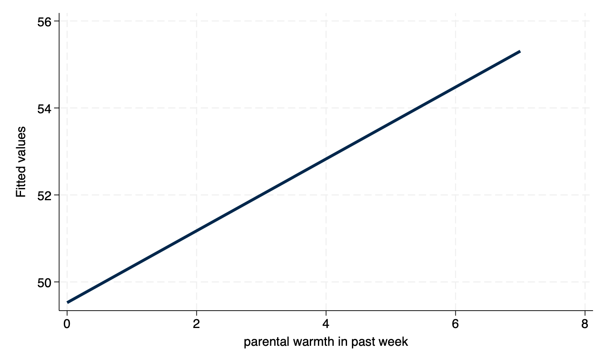
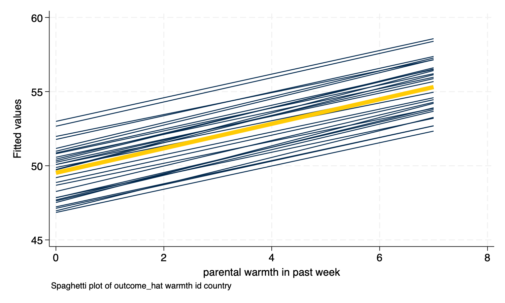
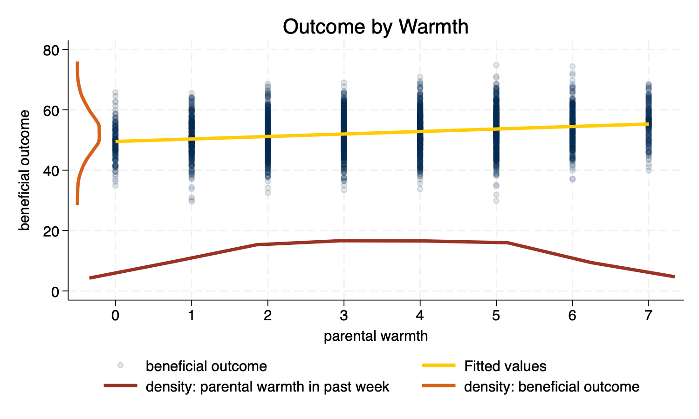

# Visualizing Multilevel Models
Andy Grogan-Kaylor
2024-10-19

# Introduction

An evolving set of notes on visualizing results from multilevel models.

The examples below use the `simulated_multilevel_data.dta` file from my
draft text book on *Multilevel Thinking*. Here is a [direct
link](https://github.com/agrogan1/multilevel-multilingual/raw/main/simulated_multilevel_data.dta)
to download the data.

This document relies on the extraordinary `Statamarkdown` library
(Hemken 2023).

# Organizing Questions

Try to think about some of the advantages and disadvantages of different
approaches to visualizing multilevel models. In multilevel models, we
don’t want to just *control for* variation, but to start to *explore*
the variation. Put concretely:

- Some approaches use *dots*. Some approaches use *lines*. Some
  approaches use *dots and lines*.
- Some approaches use the *raw unadjusted* data. Other approaches use
  *adjusted or model predicted* data.
- Some approaches attempt to show the *Level 2 specific regression
  lines*; some approaches only show an *average regression line*.
- What approaches might work well with *large numbers* of Level 2 units?
  What approaches might work well with *smaller numbers* of Level 2
  units?

What approach(es) do you prefer?

# Setup

I am not terrifically fond of the default `s2color` graph scheme in
earlier versions of Stata. Here I make use of the `michigan` graph
scheme available at:
<https://agrogan1.github.io/Stata/michigan-graph-scheme/>.

``` stata

set scheme michigan
```

Stata’s `s1color` scheme–available in newer versions of Stata–would also
would be an option as would be Asjad Naqvi’s incredible `schemepack`:
<https://github.com/asjadnaqvi/stata-schemepack>.

Throughout the tutorial, I make frequent use of the `mcolor(%30)` option
to add some visual interest to scatterplots by adding transparency to
the markers.

# Get Data

``` stata

use "simulated_multilevel_data.dta", clear
```

# Scatterplots (`twoway scatter y x`)

``` stata
twoway scatter outcome warmth, mcolor(%30)
    
graph export myscatter.png, width(1500) replace
```


# Simple Linear Fit (`twoway lfit y x`)

``` stata
twoway lfit outcome warmth
    
graph export mylinear.png, width(1500) replace
```


# Linear Fit With Confidence Interval (`twoway lfitci y x`)

``` stata
twoway lfitci outcome warmth
    
graph export mylfitci.png, width(1500) replace
```


# Combine Scatterplot and Linear Fit (`twoway (scatter y x) (lfit y x)`)

``` stata
twoway (scatter outcome warmth, mcolor(%30)) (lfit outcome warmth)
    
graph export myscatterlinear.png, width(1500) replace
```


# Spaghetti Plots (`spagplot y x, id(group)`)

``` stata
spagplot outcome warmth, id(country)
    
graph export myspaghetti.png, width(1500) replace
```


# Small Multiples (`twoway y x, by(group)`)

*Small Multiples*, showing a separate graph for each group in the data,
are an increasingly popular data visualization technique. Below, I build
a small multiples graph using the `by` option in Stata. I use the
`aspect` option to adjust the *aspect ratio* of the graph for better
visual presentation.

``` stata
twoway (scatter outcome warmth, mcolor(%30)) ///
(lfit outcome warmth), ///
by(country) aspect(1)
    
graph export mysmallmultiples.png, width(1500) replace
```


# Small Multiples With A Random Sample

At times, we may have *too many* Level 2 units to effectively display
them on a *spaghetti plot*, or using *small multiples*. If this is the
case, we may need to *randomly sample* **Level 2** units. This can be
difficult to accomplish as our standard `sample` command operates on
each row, or on Level 1 units.

We can accomplish random sampling at Level 2, with a little bit of code.

``` stata

set seed 3846 // random seed for reproducibility

gen randomid = runiform() // generate a random id variable
        
* by country (i.e. by Level 2 unit) replace the randomid 
* with the first randomid for that country (Level 2 unit)
* so that every person in that country has the same random id

bysort country: replace randomid = randomid[1] 
    
summarize randomid // descriptive statistics for random id

twoway (scatter outcome warmth, mcolor(%30)) /// scatterplot
(lfit outcome warmth) /// linear fit
if randomid < .5, /// only use a subset of randomids
by(country) aspect(1) // by country
    
quietly: graph export mysmallmultiples2.png, width(1500) replace
```

    (2,970 real changes made)

        Variable |        Obs        Mean    Std. dev.       Min        Max
    -------------+---------------------------------------------------------
        randomid |      3,000    .6174022    .2374704   .0733026   .9657055



# Multivariate (Predicted) Relationships

> A sometimes unacknowledged point is that graphs–unless we take steps
> to correct this–reflect *unadjusted*, or *bivariate* associations. We
> may sometimes wish to develop a graphs that reflect the *adjusted* or
> *predicted* estimates from our models.

## Using Predicted Values (`predict`)

`predict` generates a predicted value for *every observation in the
data*.

> In multilevel models, *prediction* is a complex question. Prediction
> may–or may not–incorporate the information from the random effects.
> The procedures below outline graphs that incorporate predictions using
> the random effects, by using the `predict ..., fitted` syntax.

### Estimate The Model

``` stata

mixed outcome warmth physical_punishment i.intervention || country: // estimate MLM
```

    Performing EM optimization ...

    Performing gradient-based optimization: 
    Iteration 0:  Log likelihood = -9628.1621  
    Iteration 1:  Log likelihood = -9628.1621  

    Computing standard errors ...

    Mixed-effects ML regression                          Number of obs    =  3,000
    Group variable: country                              Number of groups =     30
                                                         Obs per group:
                                                                      min =    100
                                                                      avg =  100.0
                                                                      max =    100
                                                         Wald chi2(3)     = 370.90
    Log likelihood = -9628.1621                          Prob > chi2      = 0.0000

    -------------------------------------------------------------------------------------
                outcome | Coefficient  Std. err.      z    P>|z|     [95% conf. interval]
    --------------------+----------------------------------------------------------------
                 warmth |   .8330937   .0574809    14.49   0.000     .7204332    .9457543
    physical_punishment |  -.9937819   .0798493   -12.45   0.000    -1.150284   -.8372801
         1.intervention |   .6406043   .2175496     2.94   0.003      .214215    1.066994
                  _cons |   51.65238   .4664841   110.73   0.000     50.73809    52.56668
    -------------------------------------------------------------------------------------

    ------------------------------------------------------------------------------
      Random-effects parameters  |   Estimate   Std. err.     [95% conf. interval]
    -----------------------------+------------------------------------------------
    country: Identity            |
                      var(_cons) |   3.371762   .9613269      1.928279    5.895816
    -----------------------------+------------------------------------------------
                   var(Residual) |    35.0675    .910002      33.32853    36.89721
    ------------------------------------------------------------------------------
    LR test vs. linear model: chibar2(01) = 204.14        Prob >= chibar2 = 0.0000

### Generate Predicted Values

``` stata
    
predict outcome_hat, fitted // predict yhat (`fitted` uses fixed AND random effects)
```

### Graph With `twoway` Syntax

``` stata
twoway (scatter outcome_hat warmth, mcolor(%30)) (lfit outcome_hat warmth)

graph export mypredictedvalues.png, width(1500) replace
    
twoway (lfit outcome_hat warmth)
    
graph export mypredictedvalues2.png, width(1500) replace
```




### Spaghetti Plot With Predicted Values

``` stata
spagplot outcome_hat warmth, id(country)
    
graph export myspaghetti2.png, width(1500) replace
```



## `margins` and `marginsplot`

In contrast to `predict`, which generates a predicted value for *every
observation in the data*, `margins` generates predicted values at
*specific values of certain variables*.

### Estimate The Model

``` stata

mixed outcome warmth physical_punishment i.intervention || country: // estimate MLM
```

    Performing EM optimization ...

    Performing gradient-based optimization: 
    Iteration 0:  Log likelihood = -9628.1621  
    Iteration 1:  Log likelihood = -9628.1621  

    Computing standard errors ...

    Mixed-effects ML regression                          Number of obs    =  3,000
    Group variable: country                              Number of groups =     30
                                                         Obs per group:
                                                                      min =    100
                                                                      avg =  100.0
                                                                      max =    100
                                                         Wald chi2(3)     = 370.90
    Log likelihood = -9628.1621                          Prob > chi2      = 0.0000

    -------------------------------------------------------------------------------------
                outcome | Coefficient  Std. err.      z    P>|z|     [95% conf. interval]
    --------------------+----------------------------------------------------------------
                 warmth |   .8330937   .0574809    14.49   0.000     .7204332    .9457543
    physical_punishment |  -.9937819   .0798493   -12.45   0.000    -1.150284   -.8372801
         1.intervention |   .6406043   .2175496     2.94   0.003      .214215    1.066994
                  _cons |   51.65238   .4664841   110.73   0.000     50.73809    52.56668
    -------------------------------------------------------------------------------------

    ------------------------------------------------------------------------------
      Random-effects parameters  |   Estimate   Std. err.     [95% conf. interval]
    -----------------------------+------------------------------------------------
    country: Identity            |
                      var(_cons) |   3.371762   .9613269      1.928279    5.895816
    -----------------------------+------------------------------------------------
                   var(Residual) |    35.0675    .910002      33.32853    36.89721
    ------------------------------------------------------------------------------
    LR test vs. linear model: chibar2(01) = 204.14        Prob >= chibar2 = 0.0000

### Generate Predicted Values *At Specified Values* With `margins`

``` stata

margins intervention, at(warmth = (1 2 3 4 5 6 7)) // predictive *margins*
```

    Predictive margins                                       Number of obs = 3,000

    Expression: Linear prediction, fixed portion, predict()
    1._at: warmth = 1
    2._at: warmth = 2
    3._at: warmth = 3
    4._at: warmth = 4
    5._at: warmth = 5
    6._at: warmth = 6
    7._at: warmth = 7

    ----------------------------------------------------------------------------------
                     |            Delta-method
                     |     Margin   std. err.      z    P>|z|     [95% conf. interval]
    -----------------+----------------------------------------------------------------
    _at#intervention |
                1 0  |   50.02222   .3966755   126.10   0.000     49.24475    50.79969
                1 1  |   50.66283   .3955286   128.09   0.000     49.88761    51.43805
                2 0  |   50.85532   .3788571   134.23   0.000     50.11277    51.59786
                2 1  |   51.49592   .3789096   135.91   0.000     50.75327    52.23857
                3 0  |   51.68841   .3692182   139.99   0.000     50.96476    52.41207
                3 1  |   52.32902    .370554   141.22   0.000     51.60274    53.05529
                4 0  |   52.52151   .3684014   142.57   0.000     51.79945    53.24356
                4 1  |   53.16211   .3710204   143.29   0.000     52.43492     53.8893
                5 0  |    53.3546    .376464   141.73   0.000     52.61674    54.09246
                5 1  |    53.9952   .3802764   141.99   0.000     53.24988    54.74053
                6 0  |   54.18769   .3928599   137.93   0.000      53.4177    54.95768
                6 1  |    54.8283   .3977088   137.86   0.000      54.0488    55.60779
                7 0  |   55.02079   .4166062   132.07   0.000     54.20425    55.83732
                7 1  |   55.66139   .4223062   131.80   0.000     54.83369     56.4891
    ----------------------------------------------------------------------------------

### Graph With `marginsplot`

``` stata
marginsplot // plot of predicted values
    
graph export mymarginsplot.png, width(1500) replace
```


# Scatterplot With Linear Fit and Marginal Density Plots (`twoway ...`)

As another possibility, we may wish to show more of the variation, by
showing the variation in the *independent* variable and the *dependent*
variable along with a *scatterplot* and *linear fit*. This is a complex
graph and requires a little bit of manual programming in Stata.

> You could also investigate the user written program `binscatterhist`
> (`ssc install binscatterhist`) which produces a similar looking graph,
> and automates much of this work.

## Manually Generate The Densities To Plot Them Below (`kdensity ...`)

> We generate the density for *warmth* at only a few points (`n(8)`)
> since this variable has relatively few categories.

``` stata

kdensity warmth, generate(warmth_x warmth_d) n(8) // manually generate outcome densities

kdensity outcome, generate(outcome_y outcome_d) // manually generate outcome densities
```

## Rescale The Densities So They Plot Well

> You may have to experiment with the scaling and moving factors.

``` stata

replace warmth_d = 100 * warmth_d // rescale the density so it plots well

replace outcome_d = 5 * outcome_d - .5 // rescale AND MOVE the density so it plots well

label variable outcome_y "density: beneficial outcome" // relabel y variable
```

    (8 real changes made)

    (50 real changes made)

## Make The Graph (`twoway ...`)

> You may have to experiment with whether scatterplots or line plots
> work best for displaying the x and y densities.

``` stata
twoway (scatter outcome warmth, mcolor(%10)) /// scatterplot w some transparency
(lfit outcome warmth) /// linear fit
(line warmth_d warmth_x) /// line plot of x density 
(line outcome_y outcome_d), /// line plot of y density (note flipped order)
title("Outcome by Warmth") /// title
ytitle("beneficial outcome") /// manual ytitle
xtitle("parental warmth") /// manual xtitle
legend(position(6) rows(2) ) /// legend at bottom; 2 rows
xlabel(0 1 2 3 4 5 6 7) /// manual x labels
name(mynewscatter, replace)

graph export mynewscatter.png, width(1500) replace
```



# References

<div id="refs" class="references csl-bib-body hanging-indent"
entry-spacing="0">

<div id="ref-Hemken2023" class="csl-entry">

Hemken, Doug. 2023. *Statamarkdown: ’Stata’ Markdown*.
<https://CRAN.R-project.org/package=Statamarkdown>.

</div>

</div>
